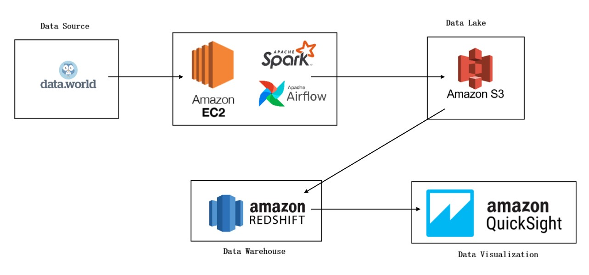
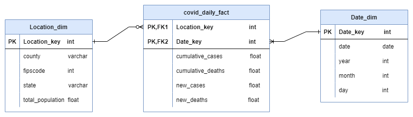
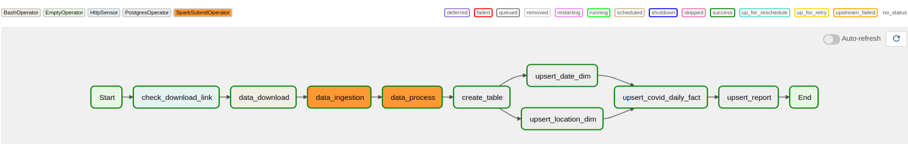
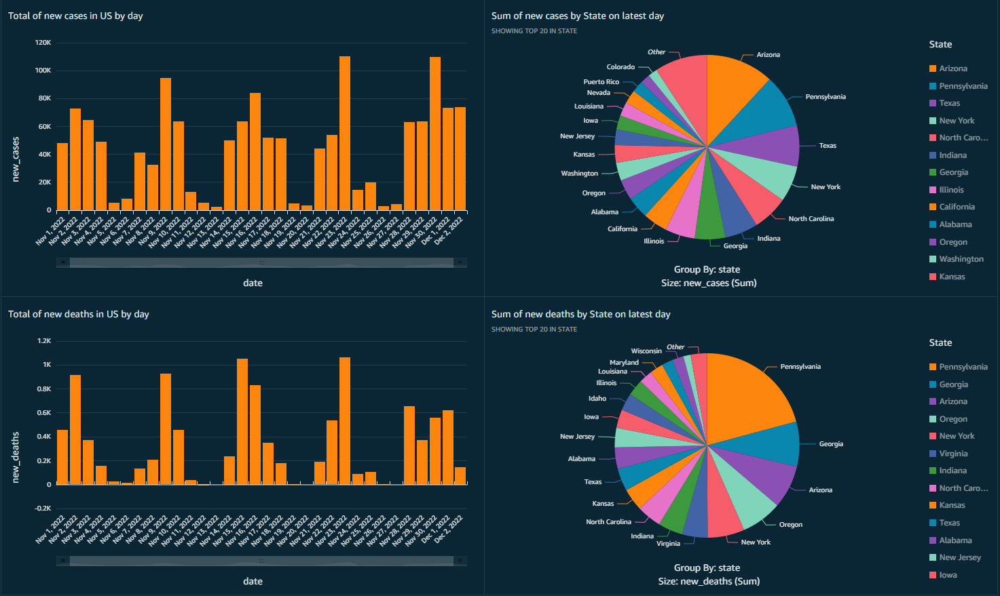

## Project description
* We have experienced Covid 19 pandemic since 2019. It took life of millions people at the peak and caused the economy to be affected. Now everything has become better, we haven't seen the reports of new cases or new deaths on the media. But if you still want to update the lastest data about the Covid 19 and you are living in USA, this project is for you.
* This project provide the data pipline, to download the newest covid data from data.word, save it into AWS S3 and build data warehouse on it using AWS Redshift.
## Data source
* The covid data contains the new cases, new deaths, cumulative cases and cumulative deaths of each county in USA day by day. It's extracted from data.word dataset: https://data.world/associatedpress/johns-hopkins-coronavirus-case-tracker/workspace/file?filename=2_cases_and_deaths_by_county_timeseries.csv. The data range from 2020 to now, but we just need the data after 2022-01-01.
## Architecture
The technical architecture for this project is as show below:

1. Data is extracted from data.word by running a python script in AWS EC2.
2. AWS S3 is used as data lake for store both raw data files and processed data files
3. Data warehouse is builded on AWS Redshift as it highly scalable and suitable for huge dataset analysis
4. Apache Spark and Apache Airflow is deployed on AWS EC2. Spark is chosen for data processing because of its parellel processing capabilities. For orchestrating the steps in the data pipline, Apache Airflow is chosen.
5. AWS QuickSight is chosen for visualizing data
# Data model
* The data model for this project is as show below:

# Data Pipline
The ETL process runs through an Airlfow DAG:

The process is as follows:
1. First, we check the link is exist or not. If the link is exist, the we download and save it into /tmp folder in EC2 insane
2. The data_ingestion task take the latest data from dataset that we have just downloaded and save it into AWS S3.
3. The data_processing task will scan all raw data in AWS S3, transform and save the result back into S3.
4. The processed data will be used to upsert tables in data warehouse
# Dashboard
* The purpose of this dashboard is to update the number of cases or deaths day by day.

